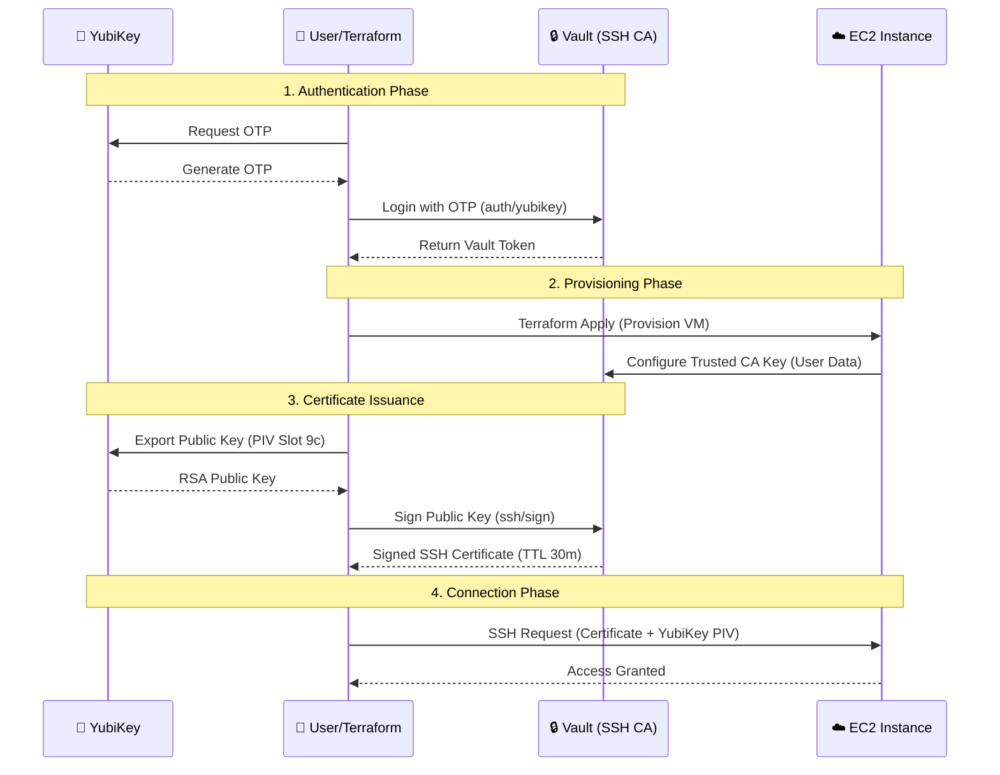

# 🔐 Sentinel-SSH: Hardware-Backed Dynamic Access

> **Zero Keys on Disk. 100% Hardware-Enforced. Ephemeral by Design.**


---

## 📖 Overview

**Sentinel-SSH** implements a reference architecture for highly secure, ephemeral SSH access to dynamic infrastructure. By combining **HashiCorp Vault's SSH CA** with **YubiKey hardware protection**, this project ensures that:

1.  **Authentication** requires physical presence (YubiKey OTP).
2.  **Private Keys** never leave the hardware token (PIV/Smart Card mode).
3.  **Certificates** are short-lived and automatically expire.

**The Result:** You can SSH into any Terraform-provisioned node without ever storing a private key on your disk.

---

## 🏗 Architecture



---

## ✅ Security Benefits

| Feature | Description | Impact |
| :--- | :--- | :--- |
| **OTP-First Login** | Vault authenticates via YubiKey OTP. | **No static passwords.** Stolen credentials are useless without the physical key. |
| **Hardware-Bound Keys** | SSH private key lives in YubiKey PIV slot. | **Un-phishable.** Even if your laptop is compromised, the attacker cannot steal your key. |
| **Ephemeral Certs** | SSH certificates expire in 30 minutes. | **Reduced Blast Radius.** No need to manage or revoke long-lived static keys. |
| ** codified Access** | Infrastructure & Access defined in Terraform. | **Auditable.** All access policies are version-controlled. |

---

## 📦 Prerequisites

Before you begin, ensure you have the following installed and configured:

*   **HashiCorp Vault** `v1.15+` (OSS or Enterprise)
*   **Terraform** `v1.7+`
*   **YubiKey 5 Series** (Supports OTP & PIV)
*   **YubiKey Manager** (`ykman`) & **Yubico PIV Tool** (`yubico-piv-tool`)
*   **AWS CLI** (Configured with EC2 provisioning permissions)
*   **OpenSSH** `v9.0+`

---

## ⚙️ Implementation Guide

### 1️⃣ Configure YubiKey

First, we prepare the YubiKey for both OTP (Authentication) and PIV (Signing).

**Step 1: Generate OTP Secret**
```bash
# Generate a static secret for Slot 1 or 2
ykman otp static --generate 
# ⚠️ Save the 44-char secret output! You'll need it for Vault.
```

**Step 2: Generate PIV Keypair**
```bash
# Generate RSA-2048 key in Slot 9c (Digital Signature)
yubico-piv-tool -s 9c -a generate -o yubikey-piv.pem -k 2048

# Import the key back into the slot (Self-sign for storage)
yubico-piv-tool -s 9c -a import -i yubikey-piv.pem
yubico-piv-tool -s 9c -a read-certificate -o yubikey-piv.crt
```

### 2️⃣ Configure Vault

Set up the Vault server to accept YubiKey OTPs and issue SSH certificates.

```bash
# 1. Enable YubiKey Auth
vault auth enable yubikey

# 2. Configure User (Replace <BASE32> with secret from Step 1)
vault write auth/yubikey/config \
    otp_secret=<BASE32> \
    otp_type=totp \
    ttl=1h

# 3. Enable SSH Secrets Engine
vault secrets enable ssh

# 4. Generate CA Keypair
vault write -field=public_key ssh/config/ca generate_signing_key=true > ca.pub

# 5. Create Signing Role
vault write ssh/roles/terraform-ssh \
    key_type=ca \
    allow_user_certificates=true \
    allowed_users="*" \
    default_extensions='{"permit-pty": ""}' \
    ttl=30m
```

### 3️⃣ Provision & Connect

Now, use Terraform to launch the infrastructure and connect securely.

**1. Authenticate to Vault**
```bash
# Generate OTP from YubiKey
OTP=$(ykman otp generate 1)

# Login and set token
export VAULT_TOKEN=$(vault write -field=token auth/yubikey/login otp=$OTP)
```

**2. Provision Infrastructure**
```bash
terraform init
terraform apply -auto-approve
```

**3. Connect via SSH (Hardware Backed)**
This command extracts the public key, asks Vault to sign it, and uses the YubiKey for the handshake.

```bash
# 1. Get Public Key from YubiKey
yubico-piv-tool -s 9c -a read -o /tmp/piv-key.pem

# 2. Convert to OpenSSH format
ssh-keygen -p -m PEM -f /tmp/piv-key.pem -N "" -P "" -C "yubikey-piv"

# 3. SSH into the node
# Note: The private key (-i) is just a stub/reference to the hardware token
ssh -i /tmp/piv-key.pem \
    -o CertificateFile=$(terraform output -raw ssh_cert) \
    ec2-user@$(terraform output -raw demo_public_ip)
```

---

> **Note:** This is a Proof of Concept. In a production environment, ensure Vault is properly sealed, unsealed, and backed by persistent storage.
